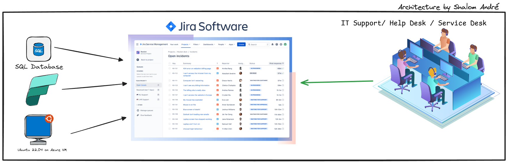
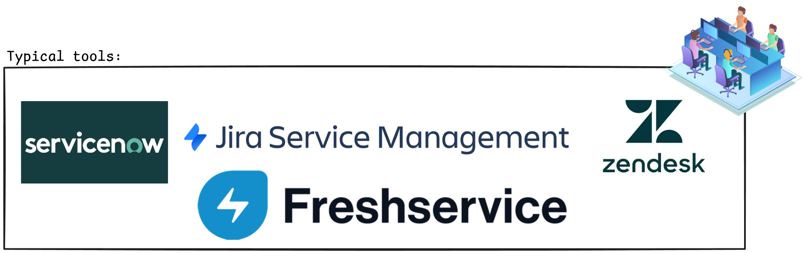
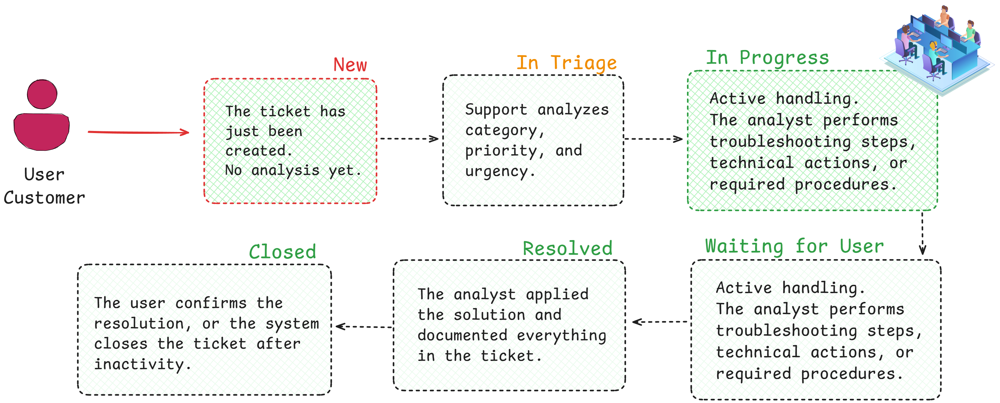

# 🛠️ ITSM Fundamentals & Ticket Resolution Demo — Jira

This repository brings together essential concepts of **IT Service Management (ITSM)**, explains how a **Ticketing System** works, presents the **ticket lifecycle**, and ends with a **practical demonstration using Jira** to resolve real tickets.

This project works as a professional portfolio to demonstrate my skills in technical support, analysis, troubleshooting, and ticket management.
---

---

# 1. What is ITSM?

**ITSM (IT Service Management)** is the set of practices and processes used by organizations to **plan, operate, deliver, and improve information technology services**.

The main focus of ITSM is to ensure that IT services:

- meet user needs  
- are aligned with business objectives  
- are delivered in a standardized and efficient manner  

Examples of common practices within ITSM:

- Incident Management  
- Request Fulfillment  
- Problem Management  
- Change Management  
- Knowledge Management

---

---

# 2. What is a Ticketing System?

A **Ticketing System** is a platform used to:

- register support requests  
- track incidents and service requests  
- assign responsibilities  
- document actions and solutions  
- ensure SLA compliance  
- generate metrics and reports  

In practice, each request is transformed into a **ticket**, which contains:

- category  
- priority  
- assignee  
- update history  
- status (lifecycle)  
- final solution  

In the video of this project, I use **Jira Service Management** to demonstrate all of this.

---

# 3. Ticket Lifecycle

The lifecycle represents the path a ticket takes from creation to closure.  
The standard flow is: New → In Triage → In Progress → Waiting for User → Resolved → Closed

---

# 4. Practical Demonstration — Resolving Tickets in Jira

In this demonstration, I show how to apply ITSM concepts within Jira Service Management, resolving different types of tickets.

### 🎫 **Ticket 1 — Password Reset (Request Fulfillment)**  
- User identity verification  
- Password reset via AD/M365  
- Clear documentation of steps  
- Resolution and closure  

### 🎫 **Ticket 2 — Application Not Opening (Incident N1)**  
- Gathering information  
- Simple diagnosis (permissions, cache, logs)  
- N1 solution application  
- Ticket update and communication  

### 🎫 **Ticket 3 — Email Account Creation (Onboarding)**  
- Policy check  
- Account creation  
- Activity logging  
- Closure within SLA  

---

# 👤 About the Author

(Insert your bio here)

